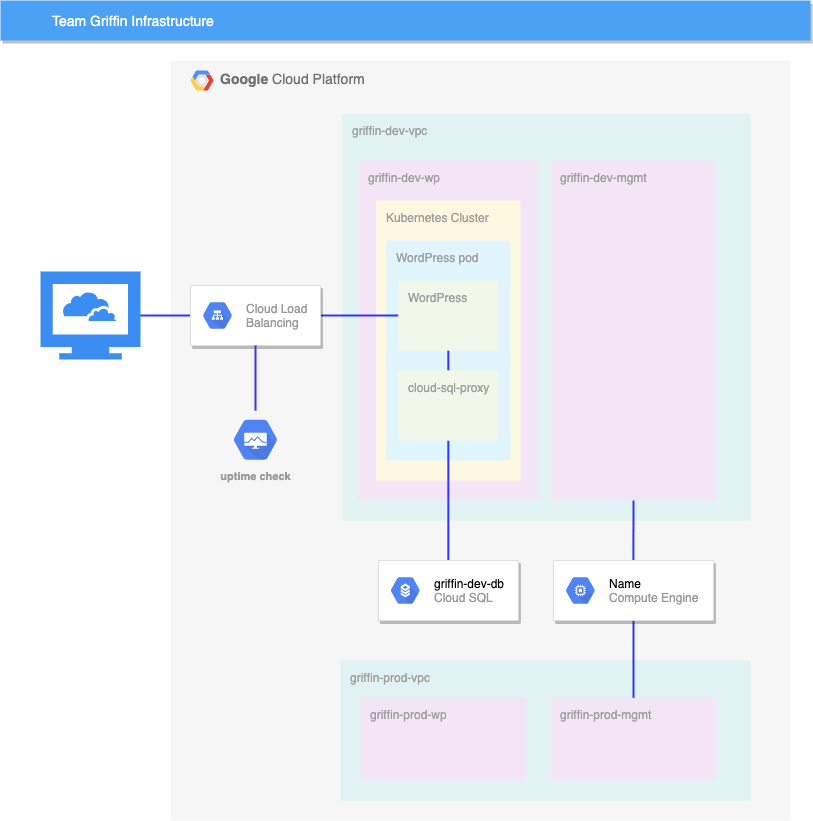

# Set up and Configure a Cloud Environment in Google Cloud
    
## In this lab , you will create the following Environment:



## Create a development VPC with two subnets manually

- Create all resources in the us-east1 region and us-east1-b zone, unless otherwise directed.
    ```
    gcloud config set compute/region us-east1
    ```
    ```
    gcloud config set compute/zone us-east1-b
    ```
- Create a VPC called griffin-dev-vpc with two subnets only 
    ```
    gcloud compute networks create griffin-dev-vpc --subnet-mode=custom
    ```
    ```
    gcloud compute networks subnets create griffin-dev-wp --network=griffin-dev-vpc --range=192.168.16.0/20 
    ```
    ```
    gcloud compute networks subnets create griffin-dev-mgmt --network=griffin-dev-vpc --range=192.168.32.0/20
    ```
- Create production VPC using Deployment Manager
    
    ```
    gsutil cp gs://cloud-training/gsp321/dm/* .
    ```
    ```
    gcloud deployment-manager deployments create network-prod-deployment --config prod-network.yaml
    ```
- Create bastion host

    ```
    gcloud compute firewall-rules create allow-ssh-dev --network=griffin-dev-vpc --action=allow --rules=tcp:22 --direction=ingress
    ```
     ```
    gcloud compute firewall-rules create allow-ssh-prod --network=griffin-prod-vpc --action=allow --rules=tcp:22 --direction=ingress
    ```
    
    ```
    gcloud compute instances create griffin-vm --machine-type=n1-standard-1 --network-interface subnet=griffin-dev-mgmt --network-interface subnet=griffin-prod-mgmt 
    ```

- Create and configure Cloud SQL Instance

    ```
    gcloud sql instances create griffin-dev-db --tier=db-n1-standard-1 --database-version=MYSQL_5_7  --region=us-east1 --root-password=password123
    ```

    ```
    gcloud sql connect griffin-dev-db --user=root
    ```
    ```
    CREATE DATABASE wordpress;
    GRANT ALL PRIVILEGES ON wordpress.* TO "wp_user"@"%" IDENTIFIED BY "stormwind_rules";
    FLUSH PRIVILEGES;
    ```
- Create Kubernetes cluster
    ```
    gcloud container clusters create griffin-dev --num-nodes=2 --zone=us-east1-b --machine-type=n1-standard-4 --network=griffin-dev-vpc --subnetwork=griffin-dev-wp
    ```

- Prepare the Kubernetes cluster

    ```
    gsutil cp gs://cloud-training/gsp321/wp-k8s/* .
    ```
    ```
    gcloud iam service-accounts keys create key.json --iam-account=cloud-sql-proxy@$GOOGLE_CLOUD_PROJECT.iam.gserviceaccount.com
    ```
    ```
    kubectl create secret generic cloudsql-instance-credentials --from-file key.json
    ```
- Create a WordPress deployment
