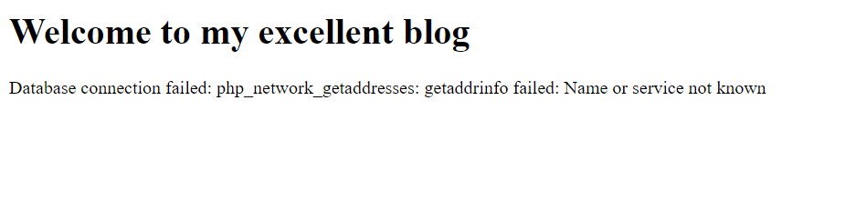

# Google Cloud Fundamentals:  Getting Started with Cloud Storage and Cloud SQL

- In this lab, We learn how to perform the following tasks:
  - Deploy a web server VM instance
  - Create a Cloud Storage bucket and place an image into it.
  - Create a Cloud SQL instance and configure it.
  - Connect to the Cloud SQL instance from a web server.
  - Use the image in the Cloud Storage bucket on a web page.

## Deploy a web server VM instance

We will deploy a apache2 web server VM instance using a startup-script and we will tag the virtual machine with **_http-server_** , tag will be used for firewall rules

```
gcloud compute instances create bloghost --zone=us-central1-a --machine-type=e2-medium --subnet=default  --metadata=startup-script=apt-get\ update$'\n'apt-get\ install\ apache2\ php\ php-mysql\ -y$'\n'service\ apache2\ restart  --tags=http-server --image=debian-9-stretch-v20200805 --image-project=debian-cloud

```

To allow HTTP traffic we will create a firewall that allows ingress TCP traffic on port 80

```
gcloud compute firewall-rules create default-allow-http --direction=INGRESS --priority=1000 --network=default --action=ALLOW --rules=tcp:80 --source-ranges=0.0.0.0/0 --target-tags=http-server

```

## Create a Cloud Storage bucket and place an image into it.

For convenience, enter your chosen location into an environment variable called LOCATION. Enter one of these commands

```
export LOCATION=US
```

In Cloud Shell, the DEVSHELL_PROJECT_ID environment variable contains the project ID. Enter this command to make a bucket named after the project ID:

```
gsutil mb -l $LOCATION gs://$DEVSHELL_PROJECT_ID
```

Retrieve a banner image from a publicly accessible Cloud Storage location:

```
gsutil cp gs://cloud-training/gcpfci/my-excellent-blog.png my-excellent-blog.png

```

Copy the banner image to newly created Cloud Storage bucket:

```
gsutil cp my-excellent-blog.png gs://$DEVSHELL_PROJECT_ID/my-excellent-blog.png

```

Modify the Access Control List of the object just created so that it is readable by everyone:

```
gsutil acl ch -u allUsers:R gs://$DEVSHELL_PROJECT_ID/my-excellent-blog.png
```

## Create the Cloud SQL instance

1. Create the instance:

```
gcloud sql instances create blog-db --tier=db-n1-standard-1 --database-version=MYSQL_5_7 --zone=us-central1-a --root-password=password123

```

We can list the sql instances and filter based on the name

```
gcloud sql instances list --filter=name=blog-db
```

**\*NB**: Public IP address is PRIMARY_ADDRESS, Save for later use\*

2. Creating a user blogdbuser

```
gcloud sql users create blogdbuser  --instance=blog-db --password=password
```

3. Connections

## Configure an application in a Compute Engine instance to use Cloud SQL

1. SSH into VM instance bloghost

```
gcloud compute ssh bloghost --zone=us-central1-a
```

2. change working directory to the document root of the web serve

```
cd /var/www/html
```

3. Use the nano text editor to edit a file called index.php:

```
sudo nano index.php
```

4. Paste the content below into the file:

```html
<html>
  <head>
    <title>Welcome to my excellent blog</title>
  </head>
  <body>
    <h1>Welcome to my excellent blog</h1>
    <?php
 $dbserver = "CLOUDSQLIP";
$dbuser = "blogdbuser";
$dbpassword = "password";
// In a production blog, we would not store the MySQL
// password in the document root. Instead, we would store it in a
// configuration file elsewhere on the web server VM instance.

$conn = new mysqli($dbserver, $dbuser, $dbpassword);

if (mysqli_connect_error()) {
        echo ("Database connection failed: " . mysqli_connect_error());
} else {
        echo ("Database connection succeeded.");
}
?>
  </body>
</html>
```

5. Press Ctrl+O, and then press Enter to save your edited file.

6. Press Ctrl+X to exit the nano text editor.

7. Restart the web server:

```
sudo service apache2 restart
```

8. Open a new web browser tab and paste VM instance's external IP address followed by /index.php.

   - result

   

9. Use the nano text editor to edit index.php again

In the nano text editor, replace CLOUDSQLIP with the Cloud SQL instance Public IP address ( example 34.67.202.5 ) that we noted above. Leave the quotation marks around the value in place.and replace DBPASSWORD with the Cloud SQL database password that we defined above. Leave the quotation marks around the value in place

The resulting will look like this:

```html
<html>
  <head>
    <title>Welcome to my excellent blog</title>
  </head>
  <body>
    <h1>Welcome to my excellent blog</h1>
    <?php
 $dbserver = "34.67.202.5";
$dbuser = "blogdbuser";
$dbpassword = "DBPASSWORD";
// In a production blog, we would not store the MySQL
// password in the document root. Instead, we would store it in a
// configuration file elsewhere on the web server VM instance.

$conn = new mysqli($dbserver, $dbuser, $dbpassword);

if (mysqli_connect_error()) {
        echo ("Database connection failed: " . mysqli_connect_error());
} else {
        echo ("Database connection succeeded.");
}
?>
  </body>
</html>
```

Press Ctrl+O, and then press Enter to save your edited file.

Press Ctrl+X to exit the nano text editor.

7. Restart the web server:

```
sudo service apache2 restart
```

8. Open a new web browser tab and paste VM instance's external IP address followed by /index.php.

   - result

   

## Configure an application in a Compute Engine instance to use a Cloud Storage object

1. Return to ssh session on your bloghost VM instance
2. Enter this command to set your working directory to the document root of the web server:`

```
cd /var/www/html
```

3. Use the nano text editor to edit index.php

```
sudo nano index.php
```

**\*NB**: We repalce the Public_link with Public link of object called my-excellent-blog.png In the bucket created early in this lab\*

```html
<html>
  <head>
    <title>Welcome to my excellent blog</title>
  </head>
  <body>
    <h1>Welcome to my excellent blog</h1>
    
    <?php
 $dbserver = "34.67.202.5";
$dbuser = "blogdbuser";
$dbpassword = "DBPASSWORD";
// In a production blog, we would not store the MySQL
// password in the document root. Instead, we would store it in a
// configuration file elsewhere on the web server VM instance.

$conn = new mysqli($dbserver, $dbuser, $dbpassword);

if (mysqli_connect_error()) {
        echo ("Database connection failed: " . mysqli_connect_error());
} else {
        echo ("Database connection succeeded.");
}
?>
  </body>
</html>
```