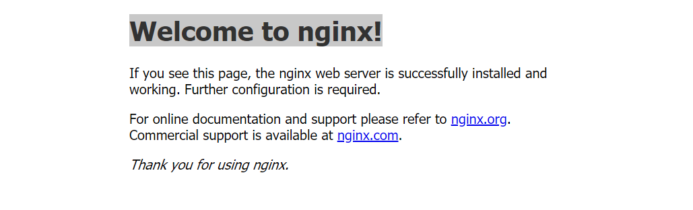

# Google Cloud Fundamentals: Getting Started with GKE

## Objectives

- In this lab, We learn how to perform the following tasks:
  - Provision a Kubernetes cluster using Kubernetes Engine.
  - Deploy and manage Docker containers using kubectl.

## Start a Kubernetes Engine cluster

For convenience, place the zone that Qwiklabs assigned you to into an environment variable called MY_ZONE. At the Cloud Shell prompt, type this partial command:

```
export MY_ZONE=us-central1-a
```

Start a Kubernetes cluster managed by Kubernetes Engine. Name the cluster webfrontend and configure it to run 2 nodes

```
gcloud container clusters create webfrontend --zone $MY_ZONE --num-nodes 2
```

After the cluster is created, check your installed version of Kubernetes using the kubectl version command

```
kubectl version

```

**\*NB**: The gcloud container clusters create command automatically authenticated kubectl .\*

## Run and deploy a container

From your Cloud Shell prompt, launch a single instance of the nginx container. (Nginx is a popular web server.)

```
kubectl create deploy nginx --image=nginx:1.17.10
```

View the pod running the nginx container:

```
kubectl get pods
```

- Result should be like this:

```
| NAME                   | READY | STATUS            | RESTARTS | AGE |
| ---------------------- | ----- | ----------------- | -------- | --- |
| nginx-5f7d5d7689-pcnzb | 0/1   | ContainerCreating | 0        | 7s  |
```

Expose the nginx container to the Internet:

```
kubectl expose deployment nginx --port 80 --type LoadBalancer
```

***NB**:*
Kubernetes created a service and an external load balancer with a public IP address attached to it. The IP address remains the same for the life of the service. Any network traffic to that public IP address is routed to pods behind the service: in this case, the nginx pod.

View the new service:

```
kubectl get services
```

- Result should be like this:

```
| NAME       | TYPE         | CLUSTER-IP   | EXTERNAL-IP    | PORT(S)      | AGE   |
| ---------- | ------------ | ------------ | -------------- | ------------ | ----- |
| kubernetes | ClusterIP    | 10.51.240.1  | <none\>        | 443/TCP      | 7m16s |
| nginx      | LoadBalancer | 10.51.245.63 | 34.122.235.112 | 80:30659/TCP | 50s   |
```

You can use the displayed external IP address to test and contact the nginx container remotely.

It may take a few seconds before the External-IP field is populated for your service. This is normal. Just re-run the kubectl get services command every few seconds until the field is populated.

Scale up the number of pods running on your service:

```
kubectl scale deployment nginx --replicas 3
```

- Scaling up a deployment is useful when you want to increase available resources for an application that is becoming more popular.

Confirm that Kubernetes has updated the number of pods:

```
kubectl get pods
```

- Result should be like this:

```
| NAME                   | READY | STATUS  | RESTARTS | AGE  |
| ---------------------- | ----- | ------- | -------- | ---- |
| nginx-5f7d5d7689-hx8dx | 1/1   | Running | 0        | 9s   |
| nginx-5f7d5d7689-kvr8p | 1/1   | Running | 0        | 9s   |
| nginx-5f7d5d7689-pcnzb | 1/1   | Running | 0        | 8m9s |
```

Confirm that your external IP address has not changed:

```
kubectl get services
```

- Result should be like this:

```
| NAME       | TYPE         | CLUSTER-IP   | EXTERNAL-IP    | PORT(S)      | AGE   |
| ---------- | ------------ | ------------ | -------------- | ------------ | ----- |
| kubernetes | ClusterIP    | 10.51.240.1  | <none>         | 443/TCP      | 12m   |
| nginx      | LoadBalancer | 10.51.245.63 | 34.122.235.112 | 80:30659/TCP | 6m31s |
```

Return to the web browser tab in which you viewed your cluster's external IP address. Refresh the page to confirm that the nginx web server is still responding.

- Result should be like this:

